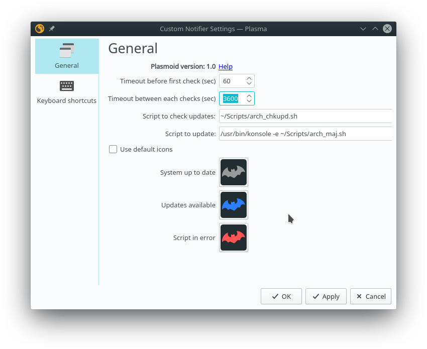
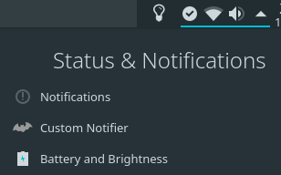
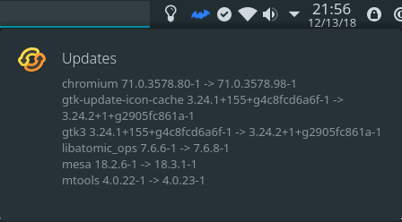
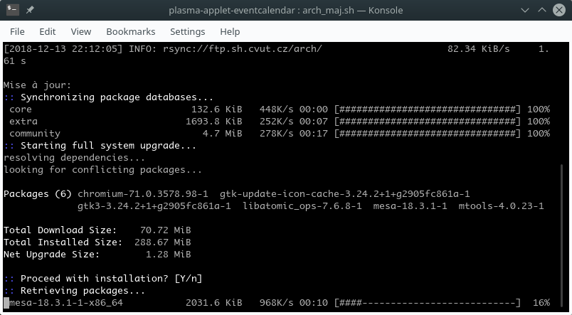
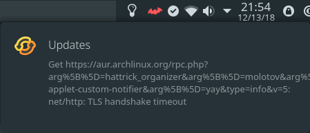

# plasma-applet-custom-notifier

Plasmoid to be notified of updates with custom scripts.

----
## Screenshots

*Configuration*

*No update, icon is hide*

*Updates availables*

*Click on icon to start update*

*Check script return an error*

----
## Install

#### Via KDE store [plasma-applet-custom-notifier](https://store.kde.org/p/xxx/)
	1. Right Click Panel > Panel Options > Add Widgets
	2. Get New Widgets > Download New Widgets
	3. Search: Custome Notifier
	4. Install
	5. Right Click your current calendar widget > Alternatives
	6. Select Event Calendar

#### Via GitLab [custom-notifier.git](https://gitlab.com/yaute74/custom-notifier.git)

	git clone https://gitlab.com/yaute74/custom-notifier.git
	cd custom-notifier
	sh ./install

	To update, run the `sh ./update` script. It will run a `git pull` then reinstall the applet.

#### Via Package Manager

**ArchLinux**: [plasma5-applets-custom-notifier](https://aur.archlinux.org/packages/plasma5-applets-custom-notifier)

    yay -s plasma-applet-custom-notifier
    
    # restart plasmashell
    killall plasmashell
    kstart5 plasmashell

----
## Configuration
**Timeout before first check (sec)**
> Timeout in seconds before the first check. Useful to wait until the machine is finished starting before starting the check.
    
**Timeout between each checks (sec)**
> Timeout in seconds between each check

**Script to check updates:**
> Script who check if the machine is up to date
>
>If the script return 0 with nothing in the stdout, it displays the 'System up to date' icon
>
>If the script return 0 woth something in the stdout, there is updates, it display the 'Updates available' icon. The stdout will be visible as tooltip.
>
>If the script return is different than 0, it display the 'Script in error' icon. The stderr will be visible as tooltip.

*Example of script for ArchLinux*

    #!/bin/sh
    set -e

    # repo updates
    checkupdates

    # AUR updates
    yay -Qu --aur

**Script to update**
> Script launch when we click on the plasmoid. Launch with the console to see what append. At script end the plasmoid will start the check script.

*Example of commande*

    /usr/bin/konsole -e ".../myscript.sh"

*Example of script for archlinux*

    #!/bin/bash

    export WRAPPER=yay

    echo
    echo "Updates:"
    ${WRAPPER} -Syyu --devel

    echo
    echo "Config files:"
    sudo env DIFFPROG="nvim -d" pacdiff

    echo
    echo "Obsolete packets:"
    ${WRAPPER} -Qdt

    echo
    echo "Paquets in AUR:"
    ${WRAPPER} -Qm

	echo
	echo "Files not presents"
	sudo pacman -Qqk

    echo wait ...
    read -r a

**icons**
>You change the default icons.
